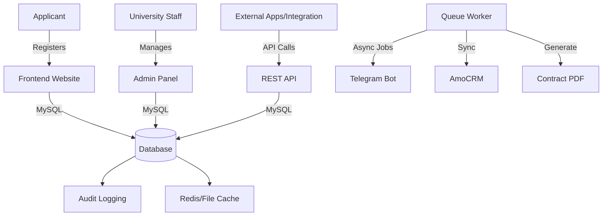

# University Admission System Architecture

## Overview
The system is built on Yii2 Advanced Application Template, providing a multi-app structure (frontend, backend, api) with shared models and components.

## Component Interaction

## Data Flow: Applicant to Enrollment
1. **Registration**: Applicant fills initial form on Frontend.
2. **Identification**: Uploads Passport & Photo. Validated via `PinflValidator`.
3. **Exam**: Registers for an available slot. Questions generated from subject pool.
4. **Scoring**: System calculates score instantly. If passed, status moves to `CONTRACT`.
5. **Contract**: Applicant signs e-offerta. System generates unique `UNI-2026-XXXXXX` number.
6. **Payment**: Once payment recorded, status becomes `PAID`.

## Key Relationships
- `Student` belongs to `Branch` and `Direction`.
- `StudentExam` links `Student` with `Exam` and `ExamDate`.
- `StudentOferta` tracks the contract and payment state.
- `AuditLog` tracks every state mutation across all models.
